# JAVASCRIPT
Prima di iniziare a programmare scriviti i vari passaggi in modo da avere sotto gli occhi le procedure da portare avanti step-by-step con uno pseudo-codice per poi ampliare il codice in ordine.  
AND richiede che si verifichino entrambe le condizioni. 
OR richiede che si verifichi almeno una condizione. 
Javascript è un linguaggio usato principalmente per il front-end. 
Il codice inline si utilizza usando il tag script e quando si usa sempre il tag script con l'attributo src. 

## Si può scrivere nell'html con writeln

## Si può scrivere con alert facendo uscire una allerta
## Si può modificare un pezzo dell'html con la dom manipulation con innerHTML

Le variabili sono contenitori che contengono dati ed informazioni richiamabili in un secondo momento.

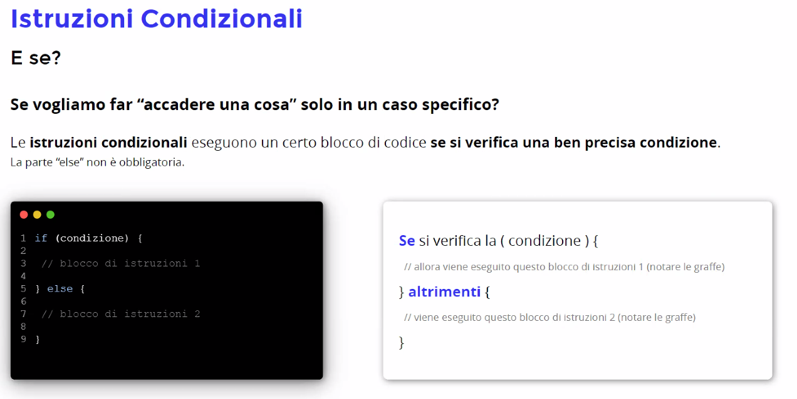

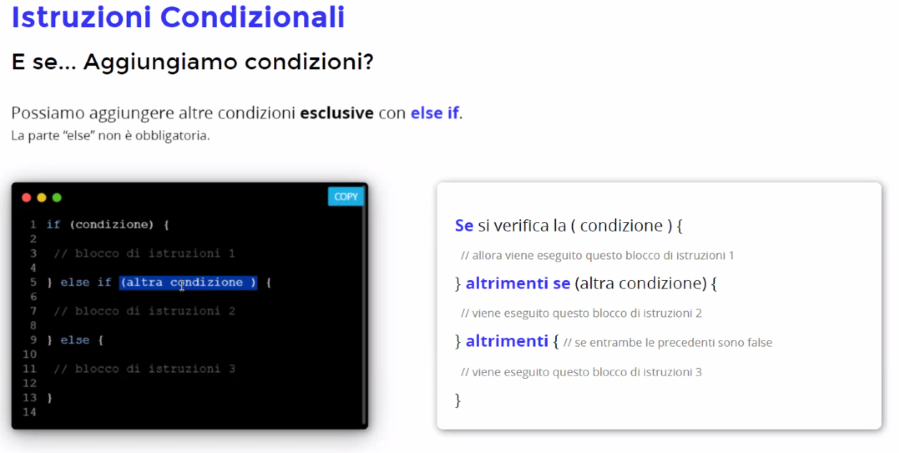

Le condizioni devono rispondere sempre con true o false.

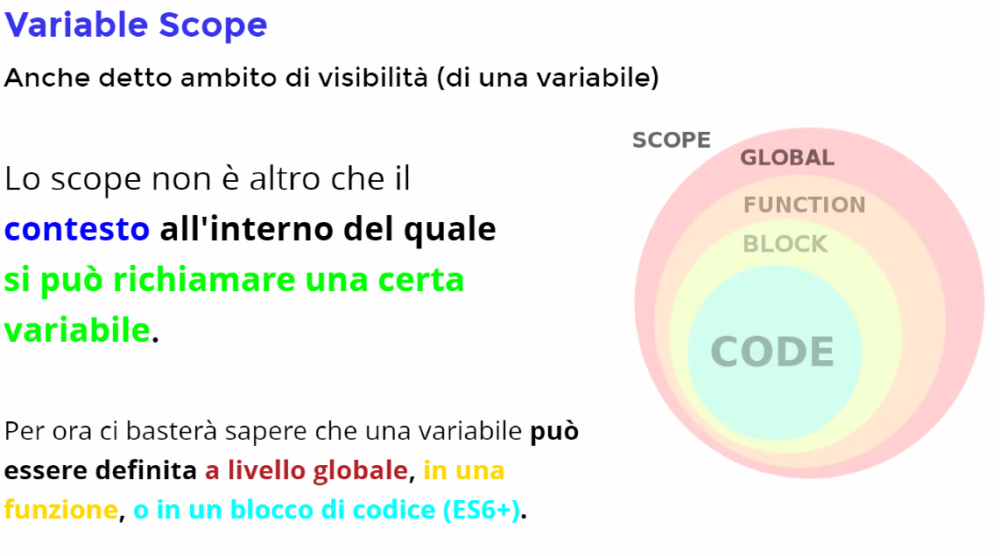

Con queryselector seleziono il primo elemento e posso richiamarlo con il suo nome (es .btn chiamo la classe btn). Usando .classList mi restituisce la lista delle classi di un elemento e posso andare a modificare le proprietà (esempio .add oppure .remove). 
Con += aggiungo a ciò che già è presente (esempio .innerHTML += 'luca' aggiunge luca a ciò che era già scritto). 

## Breve intro alle funzioni

function name(params) {}

Per esempio alert è una funzione

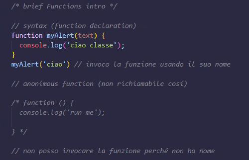

addEventListener () dentro le parentesi vuole obbligatoriamente almeno due cose, la seconda della quale è la funzione che avviene all'evento. 

# Loops ( o Cicli)
ovvero basta copia e incolla

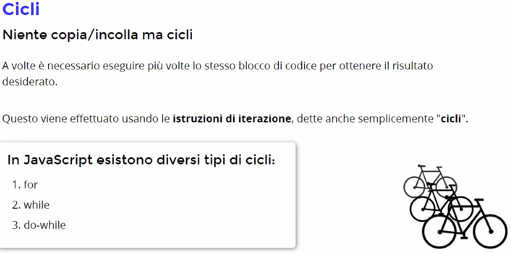

## 1 - Ciclo for

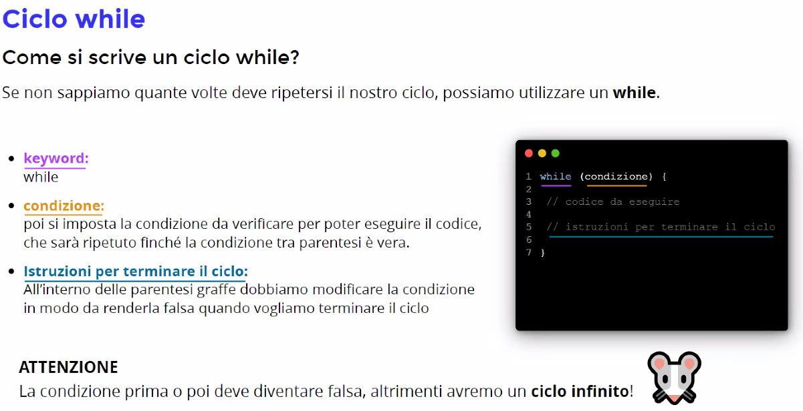

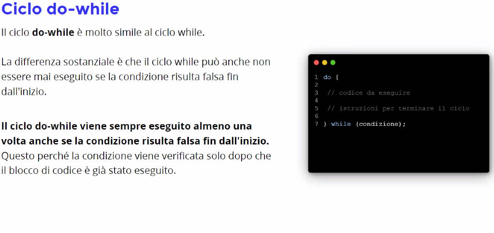

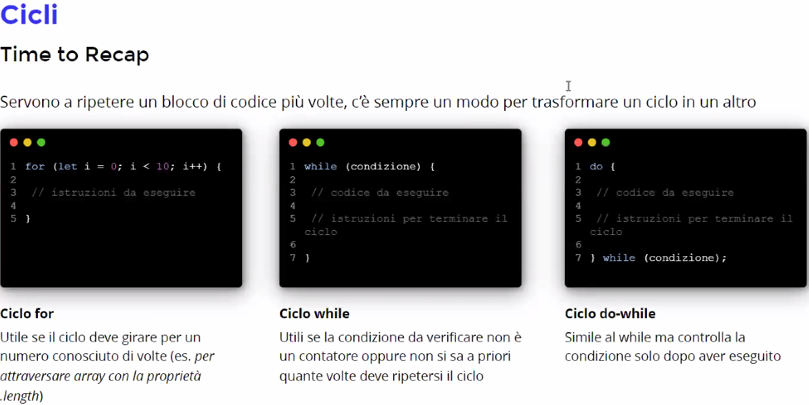

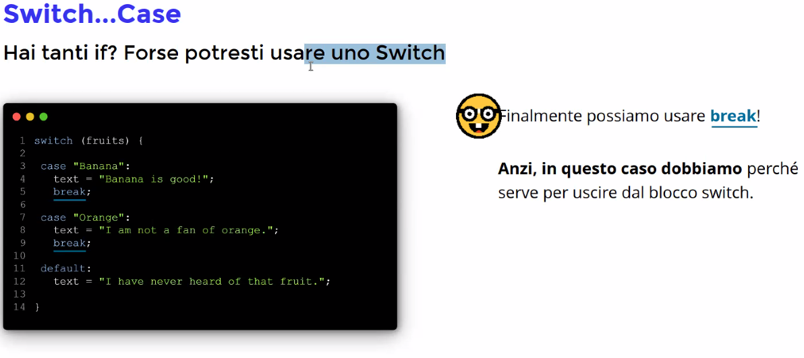

# [Switch Case](https://www.w3schools.com/js/js_switch.asp)

# Function
Possiamo richiamare del codice già utilizzato per non ripetere.
E' buona norma riutilizzare in modo da non ripetersi. Il codice risulta più pulito. Sono pezzi di codice da richiamare più volte in pagina. 

Posso poi invocare la funzione ogni volta richiamandola. Nelle parentesi tonde possono esserci dei parametri.

Diamo un nome espressivo alla funzione in modo che si capisca a cosa si riferisce.

## I parametri da soli servono da 'segnaposto' nel senso che non hanno valore finchè non lo inseriamo noi attraverso l'invocazione della funzione.

Parametro è dentro la funzione, l'argomento è quando definisco il parametro.

## La parola chiave return fa terminare la funzione

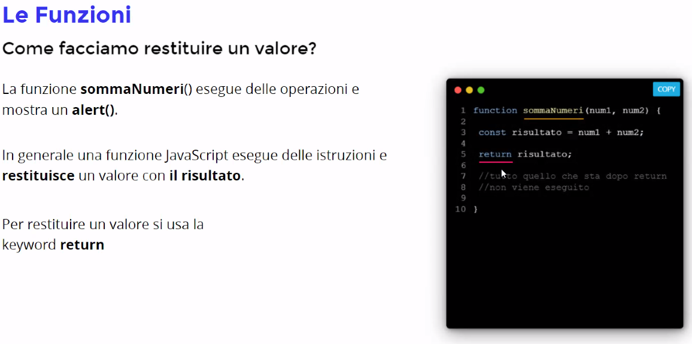

## Possiamo riusare la logica della funzione su un addEventListener

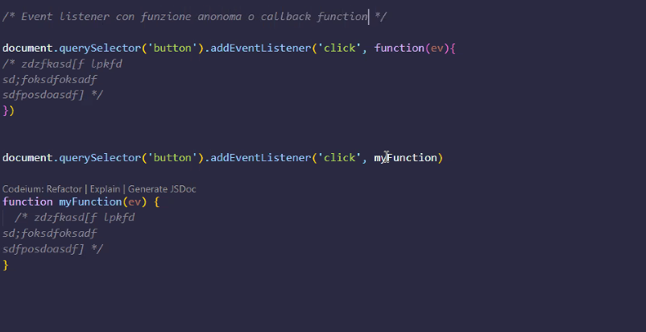

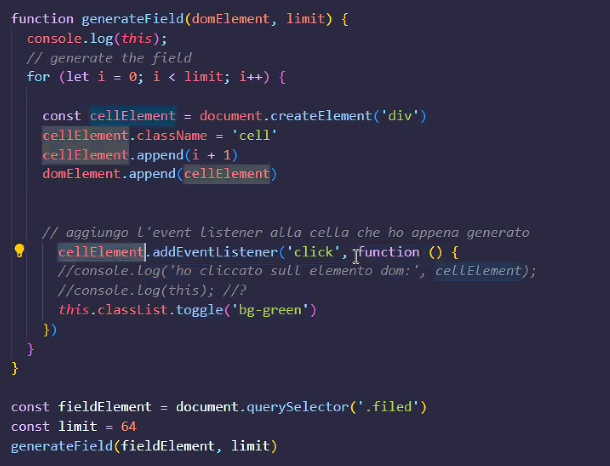

## This è una parola chiave per recuperare l'elemento della DOM selezionato in precedenza

## function declaration = function my_function_name(params) {}
## my_function_name()

oppure

## const my_second_function = function() {}

# [IIFE](https://developer.mozilla.org/en-US/docs/Glossary/IIFE) (immediatly invoked function expression) 

## (function({ })) ();

# C'è poi un metodo per scrivere le funzioni più snelle --> Arrow Functions

Il this è riferito diversamente a seconda del suo posizionamento.

# Timing Function

Funzioni non sincrone, posso lasciarle in attesa finchè non tolgo io la "pausa".
Evito di bloccare il programma se ci sono delle tecniche che richiedono attese di risposta.

## setTimeout Eseguo il codice dopo un tot di tempo

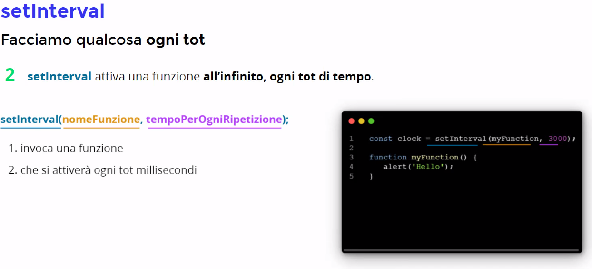

## setInterval Eseguo il codice ogni tot tempo

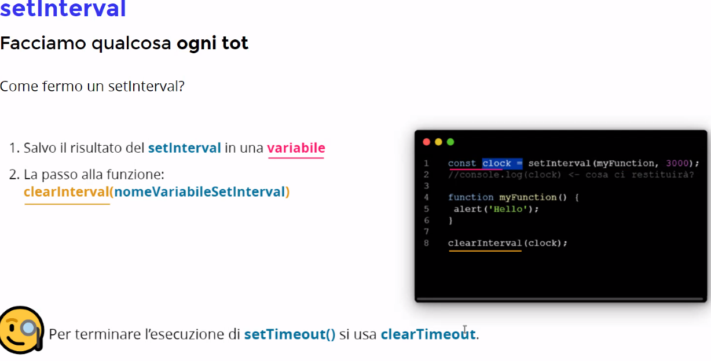

## Per bloccare l'esecuzione

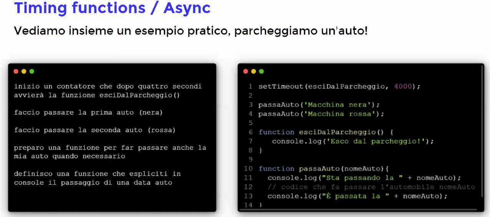

# Objects

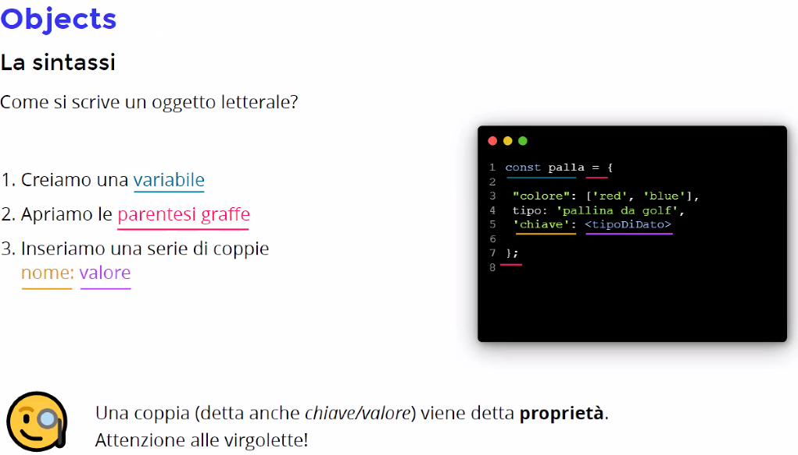

# For Each

Per ciclare in un array

## Map crea un nuovo array con return obbligatorio
Creo una nuova mappatura
## Filter se verifica il suo elemento crea un array e infila il nuovo elemento
Inserisce solo i valori true, obbligatorio il return

# Local storage mi permette di salvare i dati all'interno del pc dell'user.