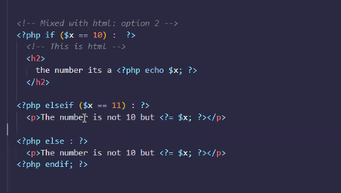
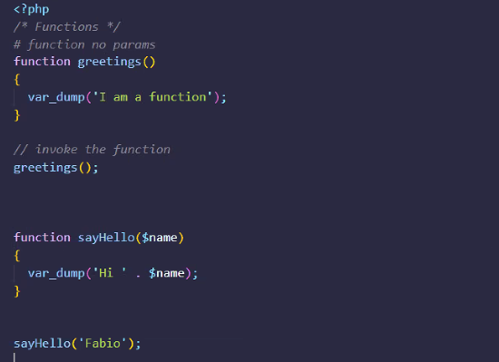

# PHP 

# ini_set('display_errors', 1);
# error_reporting(E_ALL);

# /* include __DIR__ . '/models/movie.php';
# include __DIR__ . '/models/db.php'; */

# define('ROOT', __DIR__);
# define('DS', DIRECTORY_SEPARATOR);

# require_once ROOT . DS . 'models' . DS . 'movie.php';

# require_once ROOT . DS . 'models' . DS . 'db.php';

# OOP - Programmazione Orientata all'Oggetto

## Metodo Statico

## Metodo e Variabile

# Traits

