# Laravel
Un framework back-end per semplificare il flusso del lavoro. Non devo creare da zero qualcosa che qualcuno ha già creato.

Ogni framework ha degli aspetti comuni, una volta imparato Laravel avremo facilità con gli altri.

https://laravel.com/docs/10.x/blade

## Per filtrare un array

# Laravel Model e Controller

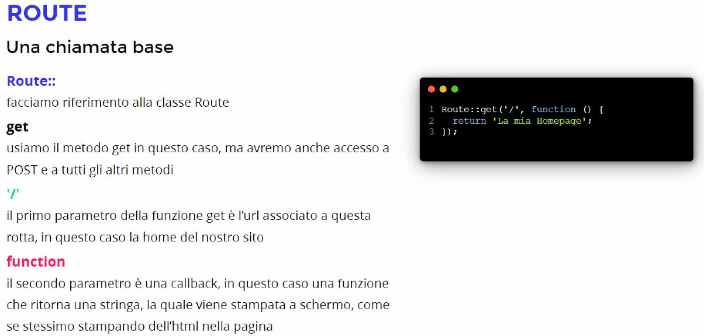

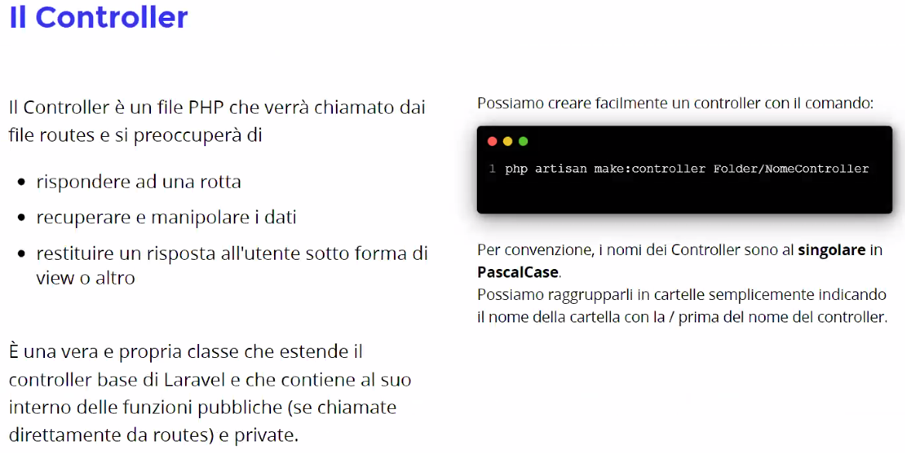

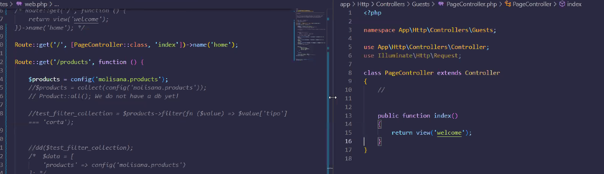

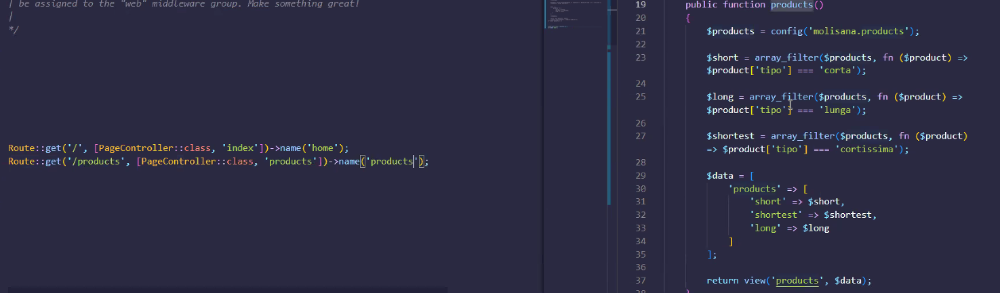

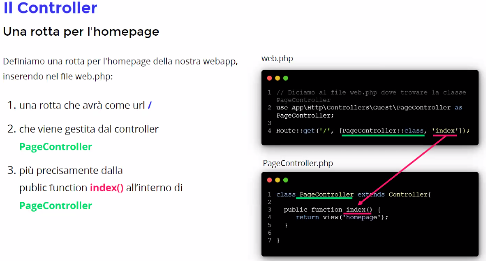

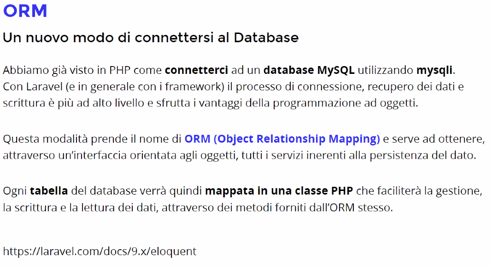

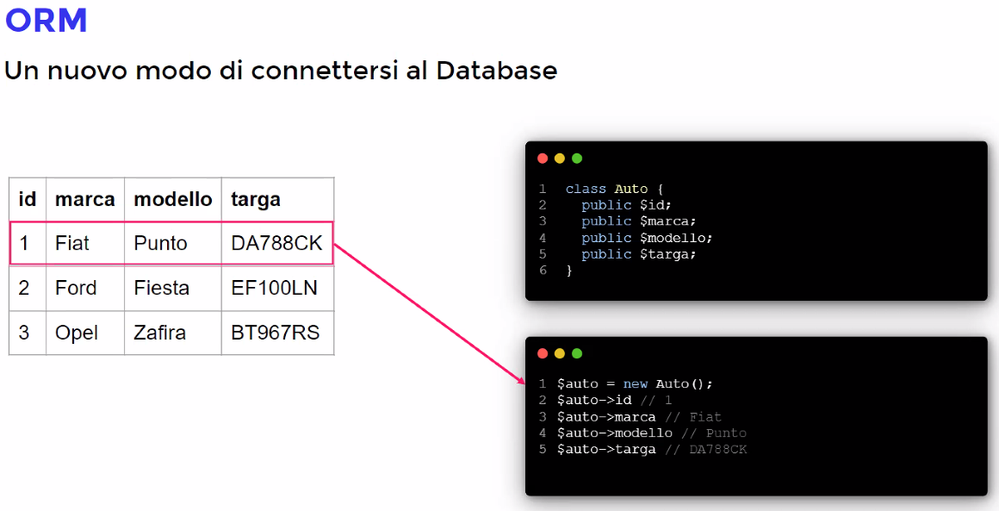

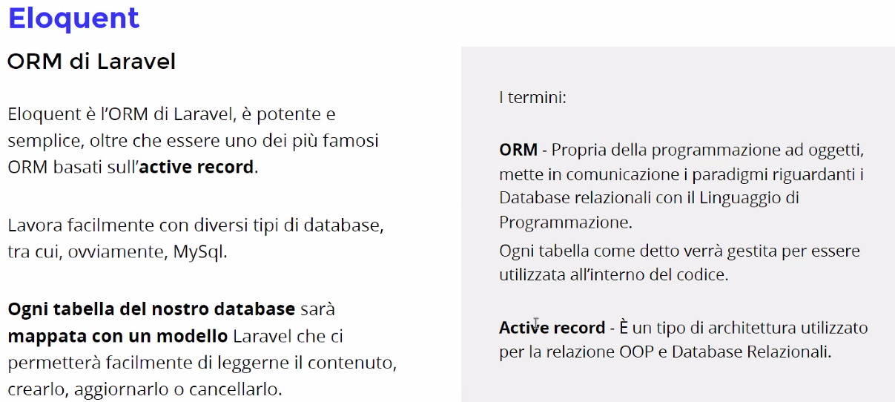

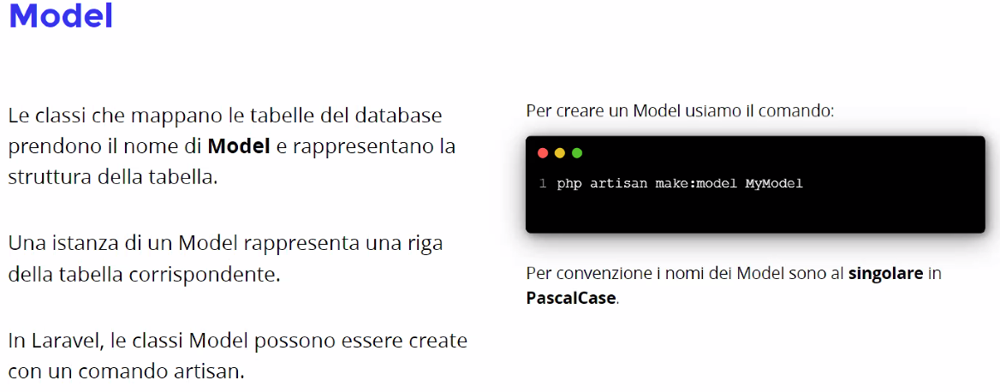

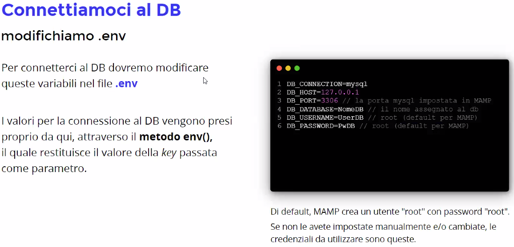

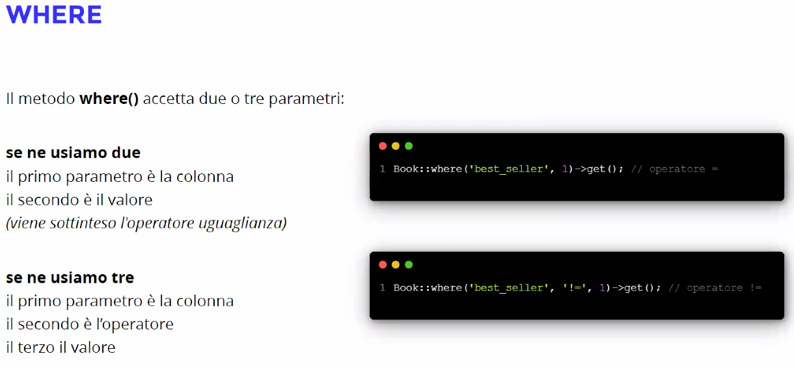

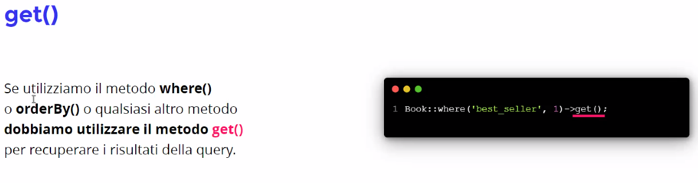

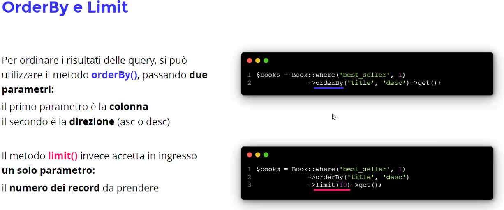

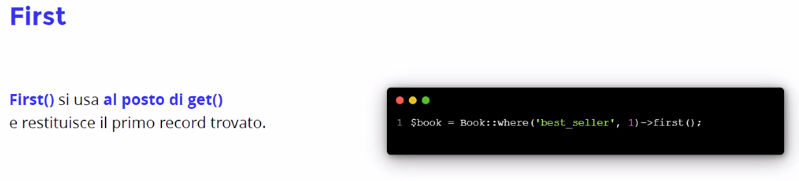

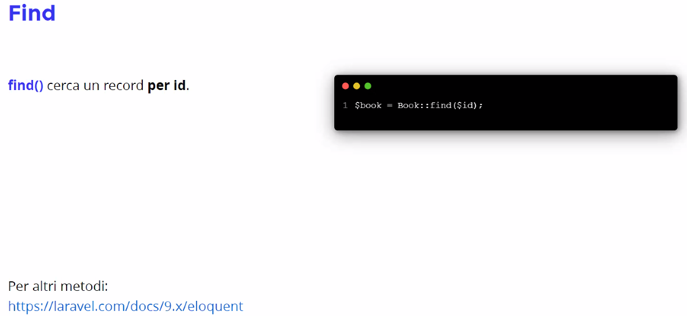

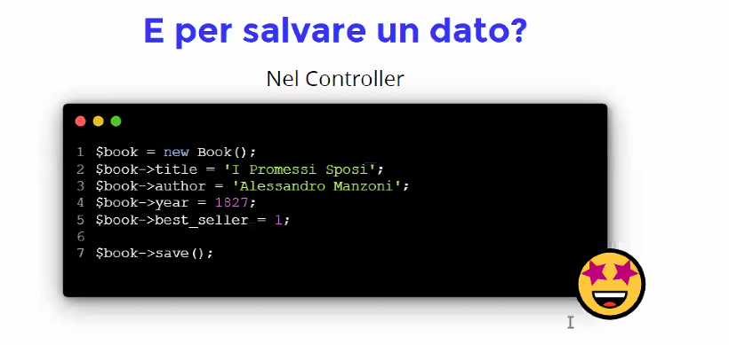

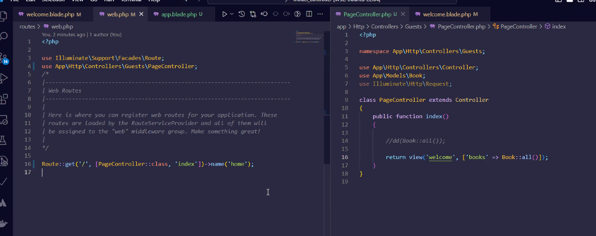

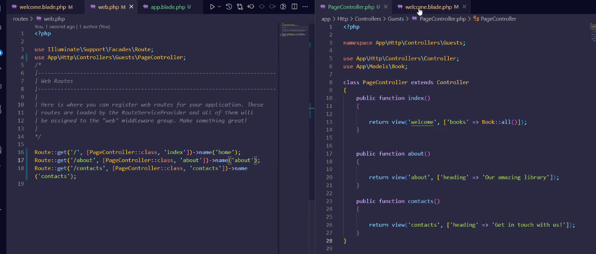

## Se all'avvio dell'applicativo Laravel si ottiene l'errore "could not find driver (SQL: select .....)" occorre effettuare questi passaggi:
- da terminale lanciare il comando php --ini
- identificare quale file INI è quello utilizzato dalla configurazione corrente e aprirlo in modifica
- trovare la riga extension=pdo_mysql e decommentarla
- salvare il file .INI e riavviare il server MAMP

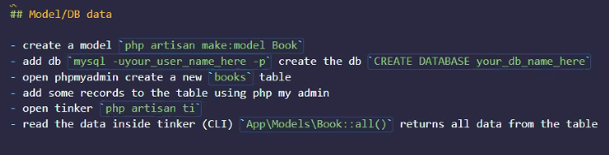

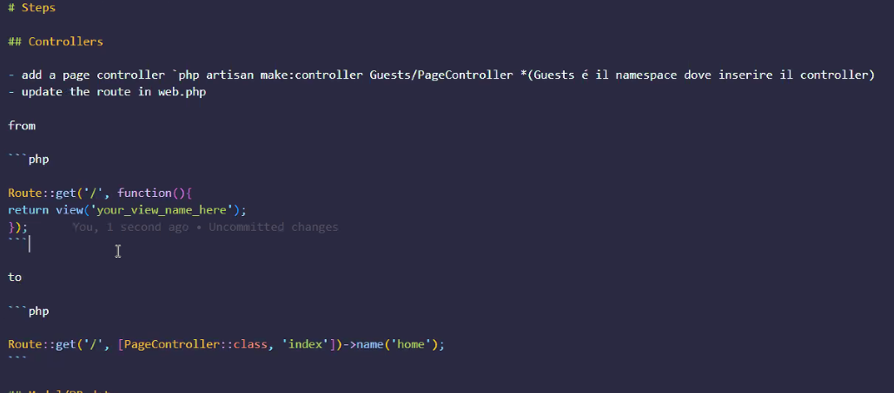

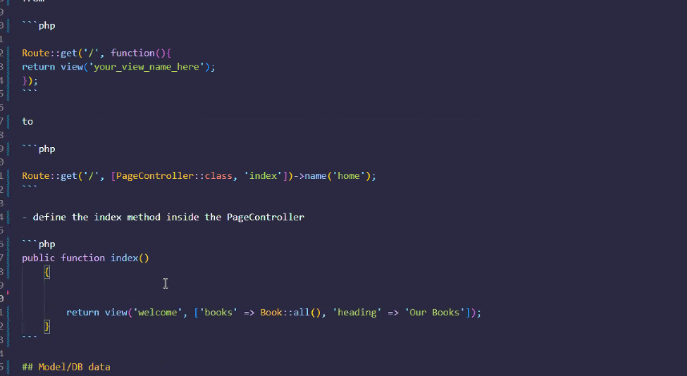

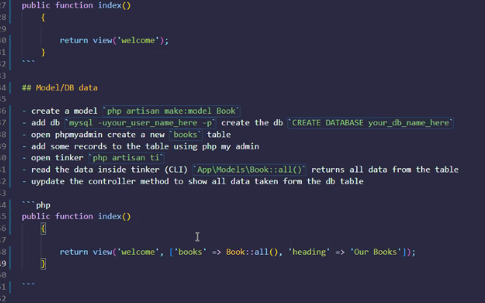

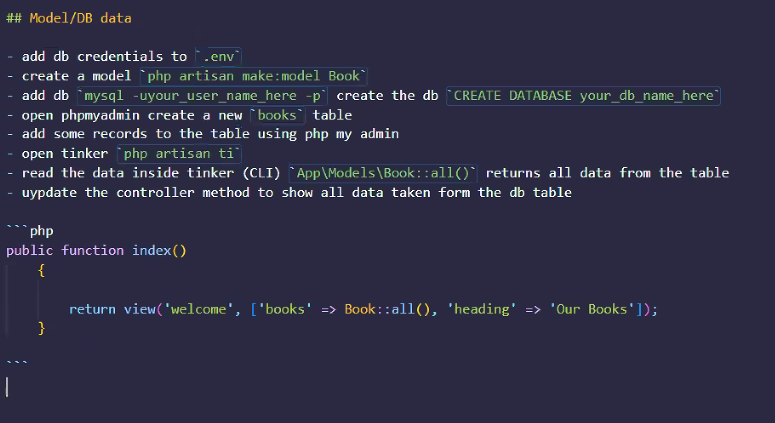

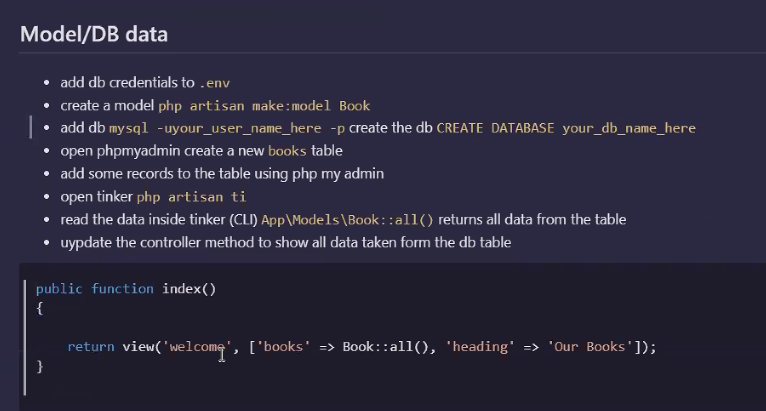

