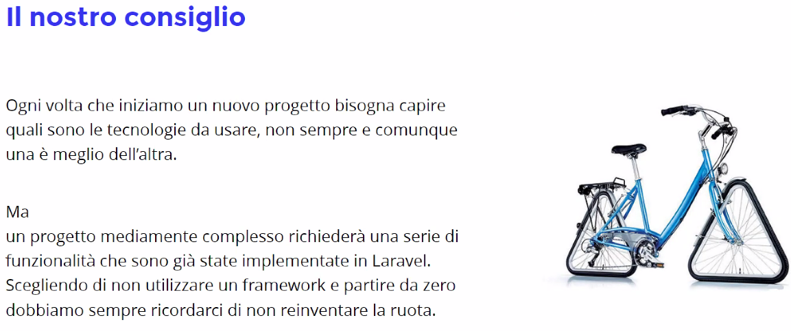

# Laravel
Un framework back-end per semplificare il flusso del lavoro. Non devo creare da zero qualcosa che qualcuno ha già creato.

Ogni framework ha degli aspetti comuni, una volta imparato Laravel avremo facilità con gli altri.

