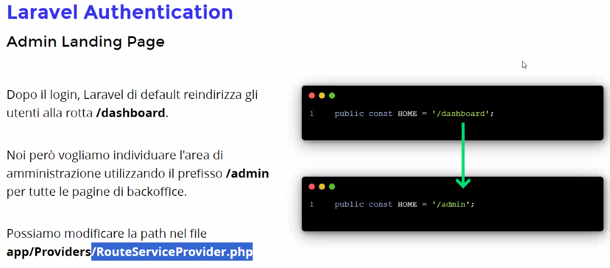
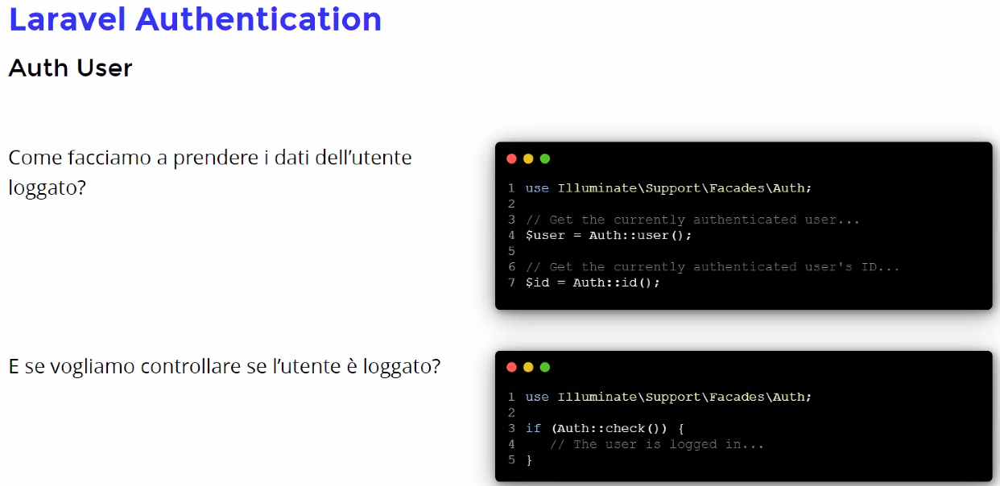

# Autenticazione

### Le password devono essere 'hashate' per non essere salvate in chiaro

E' impossibile'de-hashare' una password, una volta hashata rimane sicura

- Nel Database le password vanno salvate hashate in modo che se per caso ci entrano nel database non possono usare le password dei nostri utenti.

