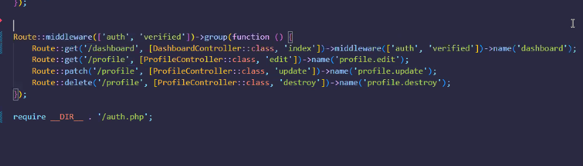
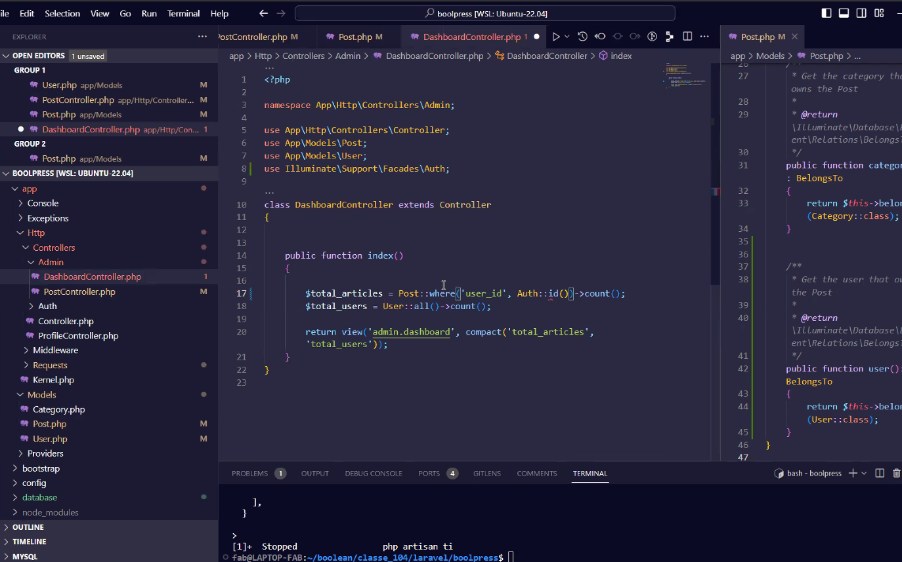

# Procedura Laravel con Laravel Breeze


https://laravel.com/docs/10.x/starter-kits#laravel-breeze

- laravel new "nome progetto"

- composer require laravel/breeze --dev

- imposto nel file .env i valori giusti per entrare nel db

- php artisan breeze:install (scegli blade, no e Pest)

- php artisan serve

- composer require pacificdev/laravel_9_preset

- php artisan preset:ui bootstrap --auth

- change js in cjs

- npm i

- npm run dev

- cancella guest ed edit dentro le view

- php artisan migrate

- php artisan make:controller Admin/DashboardController

(inserisco index al suo interno che mi return view alla admmin dashboard)
(aggiungo admin a views e ci inserisco dashboard)
(modifico nella web la rotta gestendo con il controller)


(modifico il gruppo di rotte)



(modifico le rotte con ->prefix('admin'))


Finale


 Aggiungo il nome iniziale

### Ultima


- cambio in providers il providers service per cambiare il nome della rotta


- copio la app.blade e la nuova la rinomino in admin.blade e la modifico
(posso prendere spunto dagli esempi di dashboard di bootstrap o dal layout di Fabio)

- collego file sistem in public e in config file sistem in public

- php artisan storage:link

- php artisan make:model Post -a        (ci fa policy e factory oltre a seeder e resources e controller che sposteremo in admin modificando il percorso e importando i controller)

- cancello le policy

- popolo la tabella delle migrazioni
- 
- Slug 

- entro nel seeder per compilare i dati
- 

- DatabaseSeeder
- 

- php artisan migrate

- php artisan db:seed

- se metto una image con faker creo una cartella dedicata placeholders:
-  
- ## Attenzione : potrebbe non funzionare

- php artisan ti 
(App\Models\Post::all())

- su web inserisco le rotte resource
- 
- php artisan route:list

- implemento il controller lato admin
- 

- dentro admin aggiungo la cartella dei posts e inserisco le rotte resource (index create ecc)

- su admin.posts.index implemento la view con l'estensione del layout e la section content stampando poi i miei post
-  

- recupero le immagini
- 

- ### Pagino i risultati
- php artisan vendor:publish (cerco laravel-pagination)
- 
- 

- per richiamare il post tramite lo slug e non l'id come di default uso:
- 

- su StorePostRequest authorize return true
- 
-- 

- implemento la create
- 
- creo la view come al solito con all'interno il form
- 
- validate
- 


- implemento il metodo store
- validate
- 
- use Str
- 
- ## Post::created
- aggiungo il messaggio di creazione su index
- 
- nel modello aggiungo le fillable
-  ($fillable)

- aggiungo la cartella guest sulle views e posso inserire la welcome page

- errore sulla create


## Relazione con tabelle

php artisan make migration create _categories_table


php artisan migrate

Creo un Seeder

php artisan make:seeder CategorySeeder


php artisan make:model Category

aggiungo un foreach sulla categories


creo la tabella con 
php artisan make:migration create_categories_table

php artisan db:seed --class=CategorySeeder

guardo su ti se Category::all() è stato popolato

faccio una migrazione

php artisan make:migration add_category_id_foreign_key_to_posts_table


nel metodo down faccio l'inverso


php artisan migrate

in ti App/Models/Post::all()

sui models:
hasMany sul primario
belongsTo


Importo sia HasMany che BelongsTo sui modelli interessati

passo con compact le categories alla view create del PostController

su create.phpinserisco un form custom per inserire la category


nel modello sulle fillables inserisco il category_id


nello store devo validare sullo storerequest


inserisco l'old


sulla funzione edit passiamo la category

copiamo e incolliamo il form in edit
visualizzando anche la categoria precedente se presente


sistemiamo anche sul updateRequest


nella view show stampo anche la categoria


## Posso limitare la registrazione bloccando e commentando via nel file delle rotte auth


## aggiorno i contatori




## shoh if auth


--------------------------------------------------------

- php artisan make:model Tag -ms
- creo la tabella e inserisco nome e slug
- sul seeder inserisco i nuovi tag


- foreach per i tags
new_tag = new Tag()
new_tag->name = tag
new_tag->slug = Str::slug(new_tag->name, '-')
new_tag->save()


- creo la tabella pivot

php artisan make:migration create_post_tag_table

- sulla migrazionepulisco tutto nel create e


- sul down semplicemente cancello post-tag

- passiamo table->primary([post_id, tag_id])

- sul dataseeder aggiungo le call

- php artisan db:seed

- vado a lavorare sui modelli Tag e Post


- lavoriamo con attach e detach

- sul create passiamo Tag::all()

- sulla pagina del create inserisco un bs5-multiselectcustom

- sul nome oltre al tags aggiungo [] per far ricevere più di un valore

- foreach per le options


- aggiungo tags in store request nullable ed exists:tag,id

- su store $post->tags()->attach($request->tags);   dopo il create

- su show faccio vedere i tag attraverso un forelse


- poi lavoro su edit copiando dal create

- trasmetto i tags nell'edit


- il sync va inserito nell'update 

- inserisco anche nell'UpdateRequest il campo tags con exists, id

- quando proviamo a cancellare prova a cancellare anche i tag assegnati, quindi prima bisogna rimuovere i vincoli

- in delete creo un detach


- sistemo il create


## Riepilogo

- create the model with migration and seeder
- define the migration structure
- define pivot table
- migrate
- create seeder
- seed the db
- add relationship inside the models

# Relationships

- create the new model with migration and seeder
- define the migration structure
- define the pivot table
- migrate the tables
- create seeder
- seed the db
- add relationships inside both models

## create the new model with migration and seeder

```bash
php artisan make:model Tag -ms
```

## define the tags migration structure

```php
 /**
     * Run the migrations.
     */
    public function up(): void
    {
        Schema::create('tags', function (Blueprint $table) {
            $table->id();
            $table->string('name', 50)->unique();
            $table->string('slug', 50);
            $table->timestamps();
        });
    }

    /**
     * Reverse the migrations.
     */
    public function down(): void
    {
        Schema::dropIfExists('tags');
    }

```

## define the pivot table

create the table

```bash
php artisan make:migration create_post_tag_table
```

⚡ATTENTION: The table name must follow the convention (singular table names in alphabetical order)

add columns to the pivot table

```php
 public function up(): void
    {
        Schema::create('post_tag', function (Blueprint $table) {
            // $table->id();
            $table->unsignedBigInteger('post_id');
            $table->foreign('post_id')->references('id')->on('posts');

            $table->unsignedBigInteger('tag_id');
            $table->foreign('tag_id')->references('id')->on('tags');

            // instead of the $table->id()
            $table->primary(['post_id', 'tag_id']); 
        });
    }

    /**
     * Reverse the migrations.
     */
    public function down(): void
    {
        Schema::dropIfExists('post_tag');
    }
```

## Migrate the db

`php artisan migrate`

## Seeder

## Seed the db

## Add relationships

Inside the model Post

```php

// Post.php


    /**
     * The tags that belong to the Post
     *
     * @return \Illuminate\Database\Eloquent\Relations\BelongsToMany
     */
    public function tags(): BelongsToMany
    {
        return $this->belongsToMany(Tag::class);
    }

```

Inside the Tags model define the inverse of the relationship

```php

  /**
     * The posts that belong to the Tag
     *
     * @return \Illuminate\Database\Eloquent\Relations\BelongsToMany
     */
    public function posts(): BelongsToMany
    {
        return $this->belongsToMany(Post::class);
    }
```

⚡ NOTE:
If a method uses a return type you need to import that class at the top

```php
use Illuminate\Database\Eloquent\Relations\BelongsToMany;

```