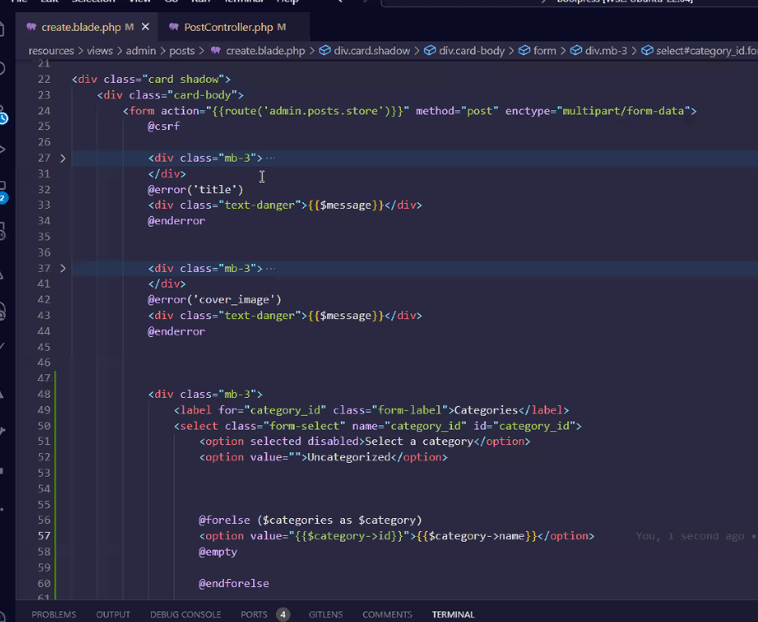

# Procedura Laravel con Laravel Breeze

https://laravel.com/docs/10.x/starter-kits#laravel-breeze

- laravel new "nome progetto"

- composer require laravel/breeze --dev

- imposto nel file .env i valori giusti per entrare nel db

- php artisan breeze:install (scegli blade, no e Pest)

- php artisan serve

- composer require pacificdev/laravel_9_preset

- php artisan preset:ui bootstrap --auth

- change js in cjs

- npm i

- npm run dev

- cancella guest ed edit dentro le view

- php artisan migrate

- php artisan make:controller Admin/DashboardController

(inserisco index al suo interno che mi return view alla admmin dashboard)
(aggiungo admin a views e ci inserisco dashboard)
(modifico nella web la rotta gestendo con il controller)

(modifico il gruppo di rotte)

(modifico le rotte con ->prefix('admin'))

Finale

 Aggiungo il nome iniziale

### Ultima

- cambio in providers il providers service per cambiare il nome della rotta

- copio la app.blade e la nuova la rinomino in admin.blade e la modifico
(posso prendere spunto dagli esempi di dashboard di bootstrap o dal layout di Fabio)

- collego file sistem in public e in config file sistem in public

- php artisan storage:link

- php artisan make:model Post -a        (ci fa policy e factory oltre a seeder e resources e controller che sposteremo in admin modificando il percorso e importando i controller)

- cancello le policy

- popolo la tabella delle migrazioni
- 
- Slug 

- entro nel seeder per compilare i dati
- 

- DatabaseSeeder
- 

- php artisan migrate

- php artisan db:seed

- se metto una image con faker creo una cartella dedicata placeholders:
-  
- ## Attenzione : potrebbe non funzionare

- php artisan ti 
(App\Models\Post::all())

- su web inserisco le rotte resource
- 
- php artisan route:list

- implemento il controller lato admin
- 

- dentro admin aggiungo la cartella dei posts e inserisco le rotte resource (index create ecc)

- su admin.posts.index implemento la view con l'estensione del layout e la section content stampando poi i miei post
-  

- recupero le immagini
- 

- ### Pagino i risultati
- php artisan vendor:publish (cerco laravel-pagination)
- 
- 

- per richiamare il post tramite lo slug e non l'id come di default uso:
- 

- su StorePostRequest authorize return true
- 
-- 

- implemento la create
- 
- creo la view come al solito con all'interno il form
- 
- validate
- 

- implemento il metodo store
- validate
- 
- use Str
- 
- ## Post::created
- aggiungo il messaggio di creazione su index
- 
- nel modello aggiungo le fillable
-  ($fillable)

- aggiungo la cartella guest sulle views e posso inserire la welcome page

- errore sulla create

## Relazione con tabelle

php artisan make migration create _categories_table

php artisan migrate

Creo un Seeder

php artisan make:seeder CategorySeeder

php artisan make:model Category

aggiungo un foreach sulla categories

php artisan db:seed --class=CategorySeeder

guardo su ti se Category::all() è stato popolato

faccio una migrazione

php artisan make:migration add_category_id_foreign_key_to_posts_table

nel metodo down faccio l'inverso

php artisan migrate

in ti App/Models/Post::all()

sui models:
hasMany sul primario
belongsTo

Importo sia HasMany che BelongsTo sui modelli interessati

passo con compact le categories alla view create del PostController

su create.phpinserisco un form custom per inserire la category

nel modello sulle fillables inserisco il category_id

nello store devo validare sullo storerequest

inserisco l'old

sulla funzione edit passiamo la category

copiamo e incolliamo il form in edit
visualizzando anche la categoria precedente se presente

sistemiamo anche sul updateRequest

nella view show stampo anche la categoria

## Posso limitare la registrazione bloccando e commentando via nel file delle rotte auth

## aggiorno i contatori

## shoh if auth

