# Rotte API

```php
Rooute::get('posts', function() {
    return[
        'status' => 'success',
        'result' => 'Ciao API Laravel'
    ];
})
```


Se non metti nulla pagina a 15 risultati


```bash
npm install axios
```


npm i --save bootstrap @popperjs/core

npm i --save-dev sass

- rinomina il file style css in scss
importa bootstrap @use "../node_modules/bootstrap/scss/bootstrap.scss"

- in main js cambia il nome in scss


admin non login

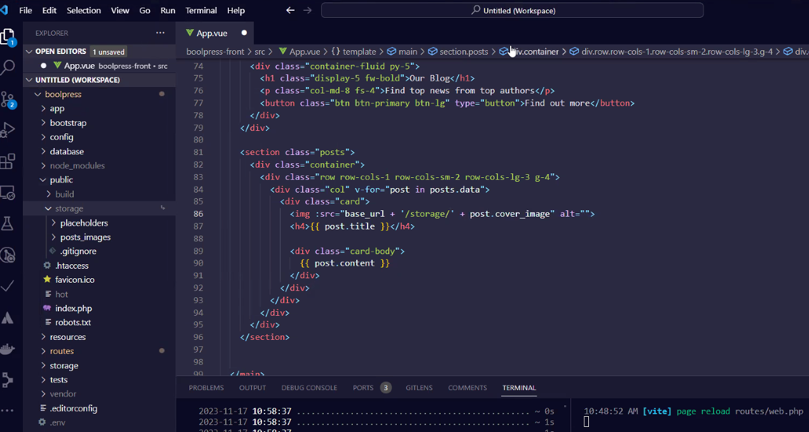
mi imposto la mia base url


- Sul seeder si possono assegnare i post all'utente con id 1


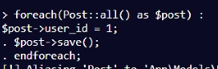

- pagination


## CORS POLICY
- su 'allowed_origins' => ['*']
permetto le origini da qualsiasi dominio o app, potenzialmente milioni di richieste.

- Se il dominio non è consentito la richiesta non va a buon fine con un http CORS error


- possiamo inserire i domini nell'array

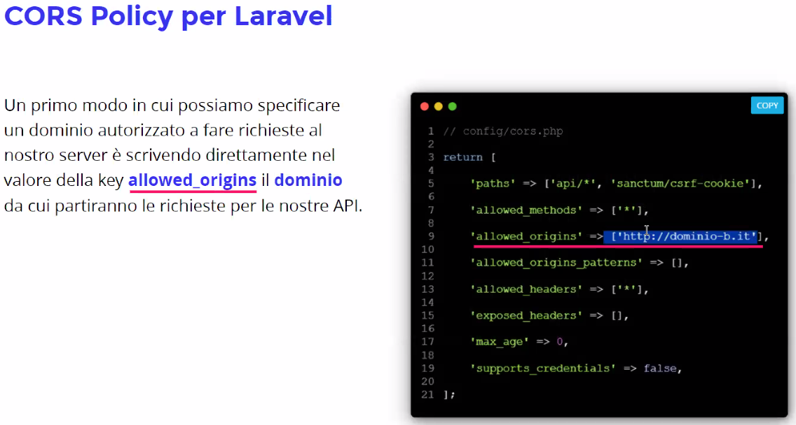


- Creo variabile in .env e in .env.example


php artisan db:seed --class=ProjectSeeced

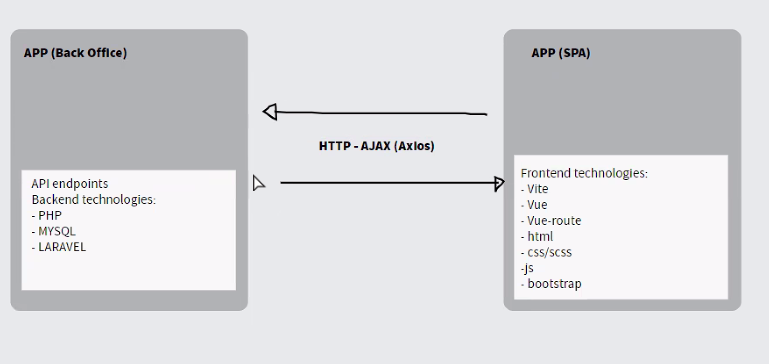

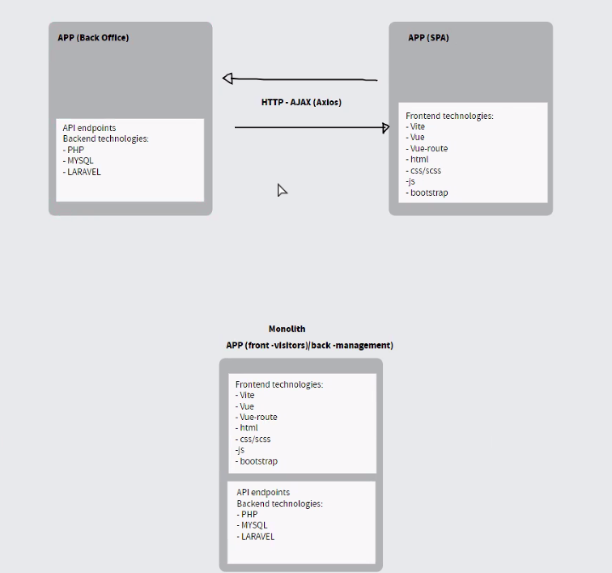

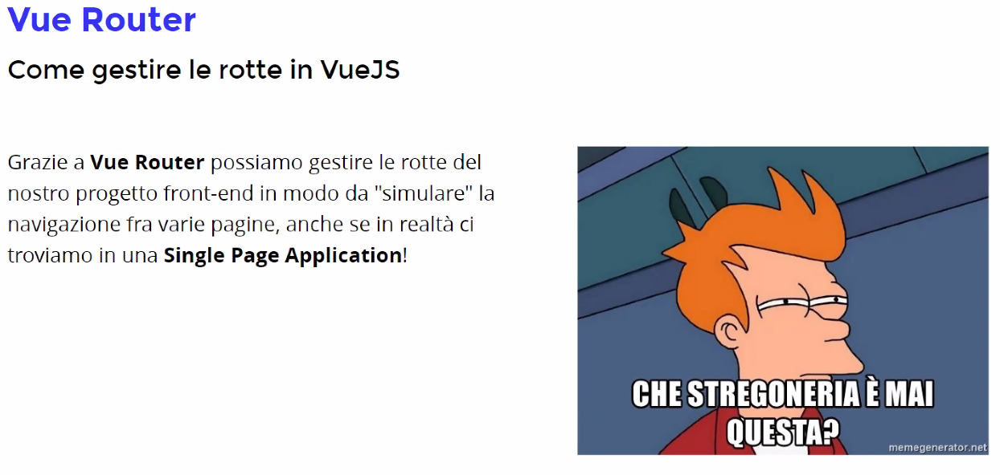

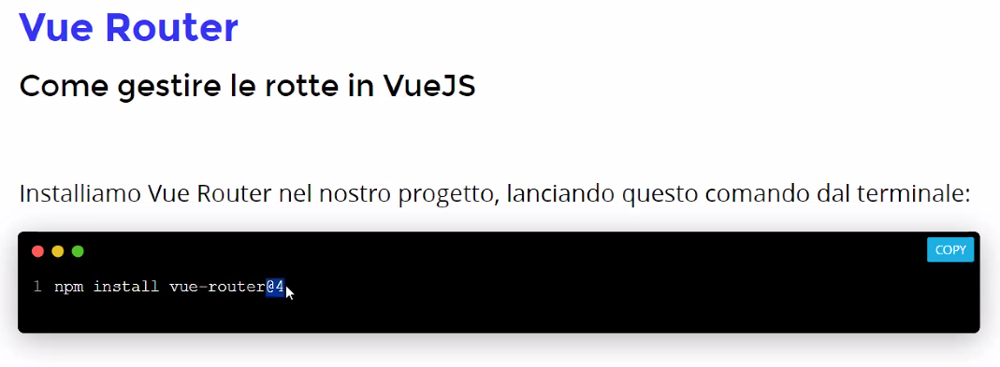

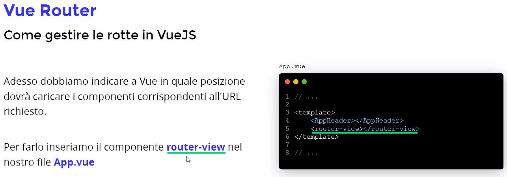

- creo un file router.js
- importo {createWebHashHystory, createRouter} from "vue-router";
- const routes = [
    {path: '/', component: Home;}
    {path: '/about', component: About}
  ];

- const router = createRouter({
    history: createWebHashHistory(),
    routes
});

- export {router}

- in main.js mi - import {router} from ./router.js

- .use(router prima di .mount)

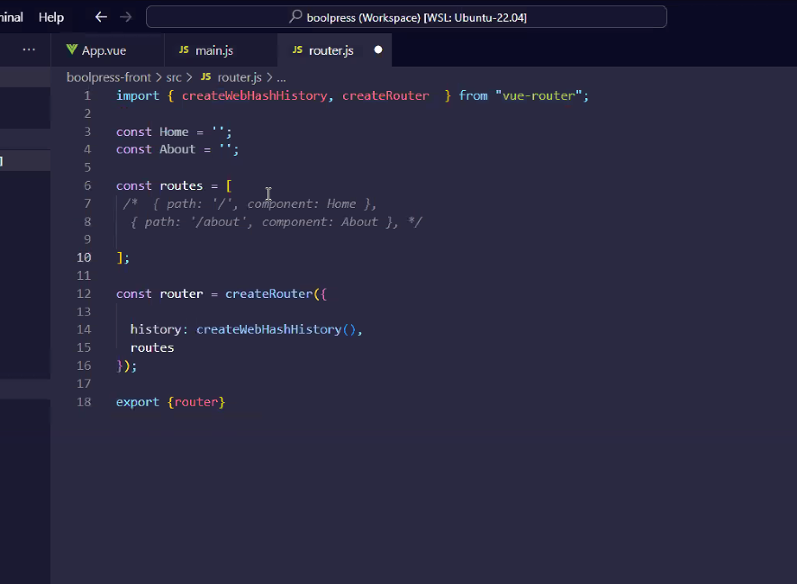

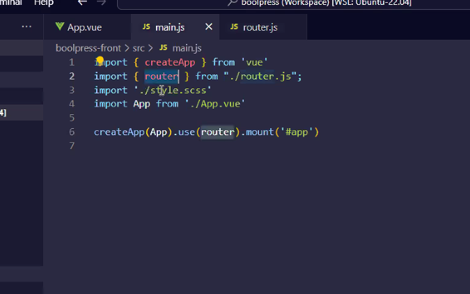

- Mi faccio una cartella views in src dove metto i componenti che conterranno la parte di view quando viene richiesta.

- mi importo i componenti in route.js

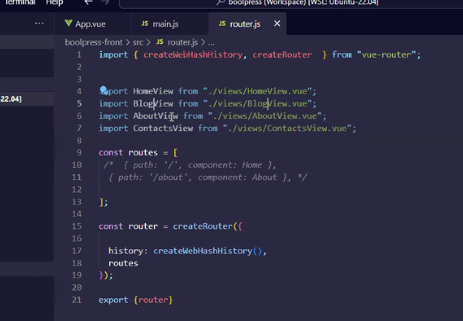

- nei componenti mi faccio la v-base

- mi imposto le giuste rotte in router.js

- sul nav cambio il tag a in router-link con to al posto dell'href

- per un singolo post
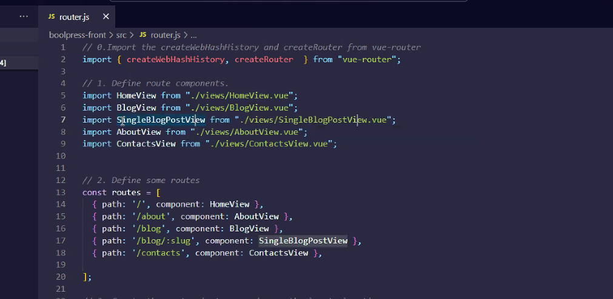
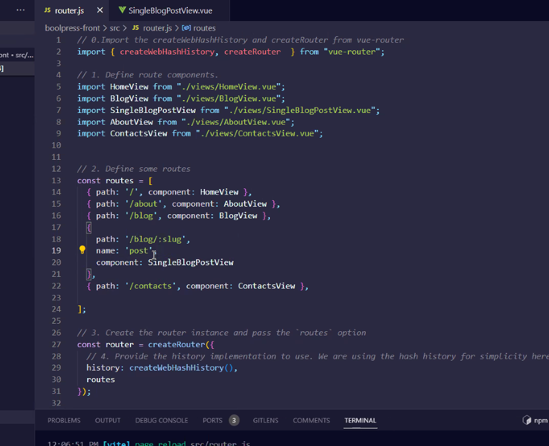

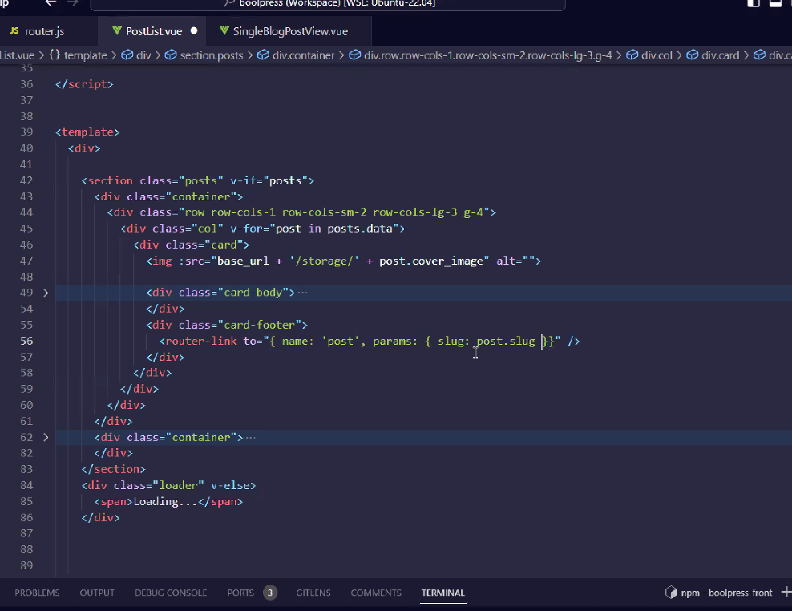

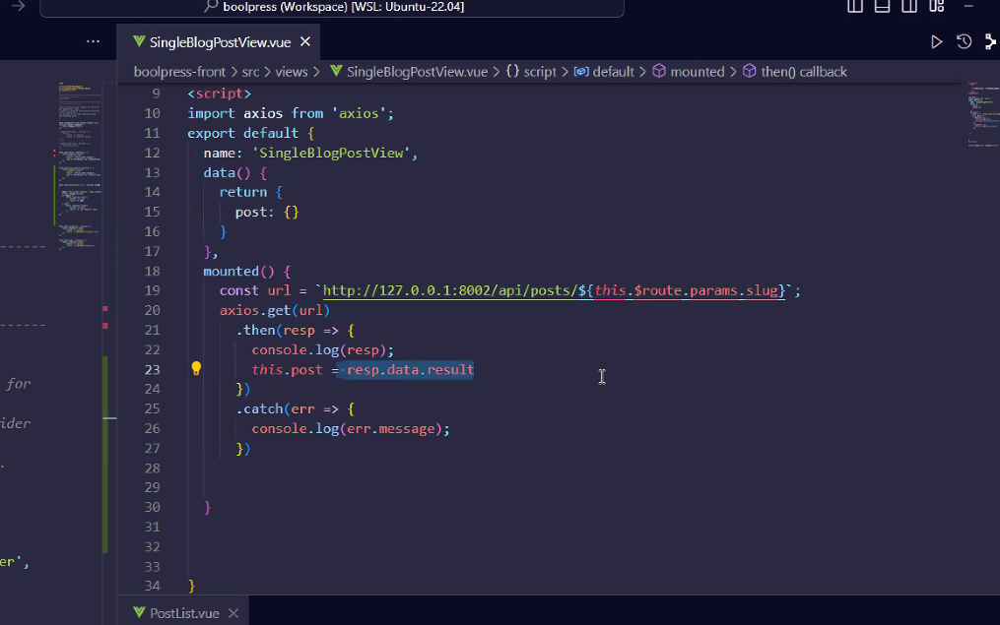

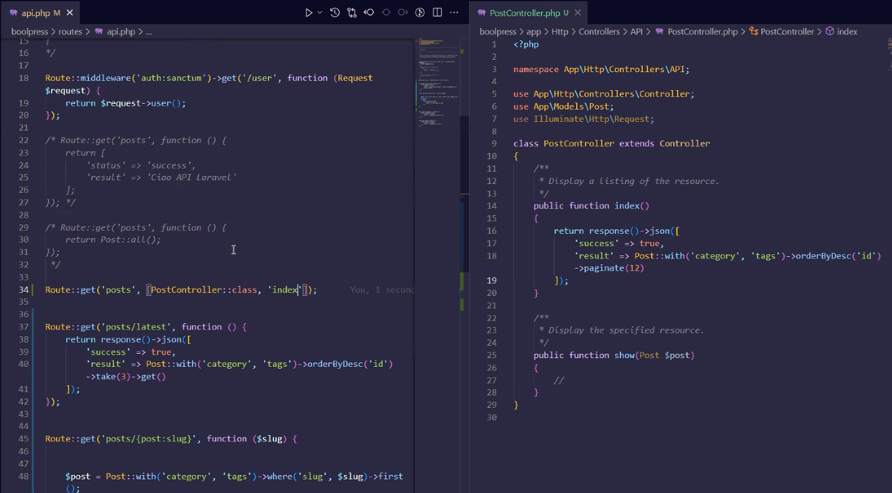

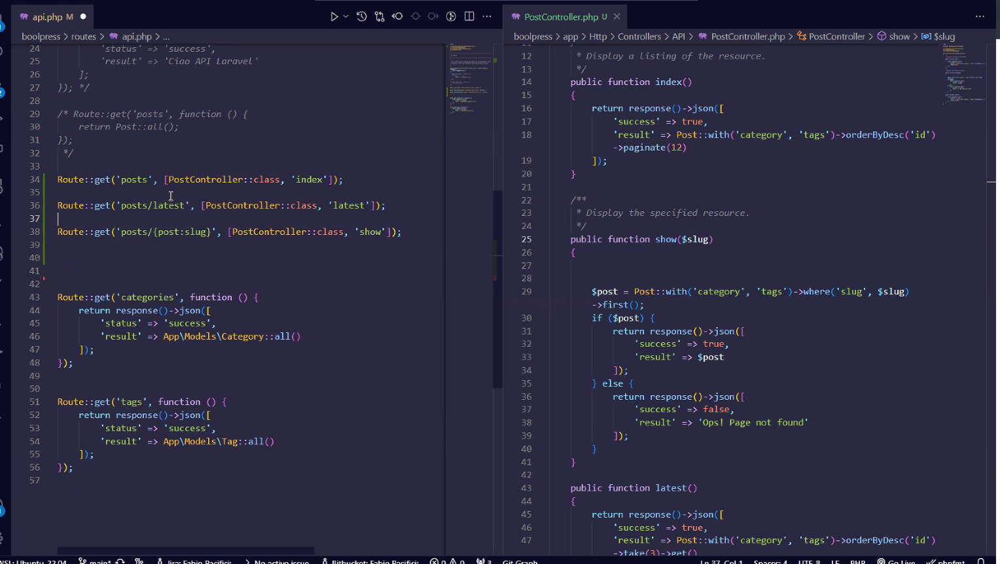

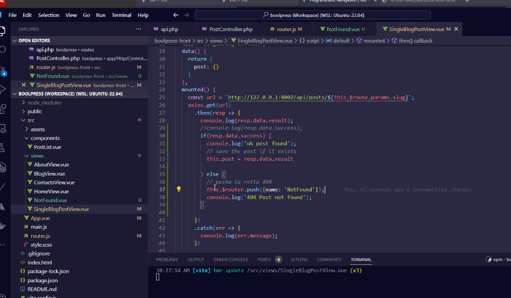

