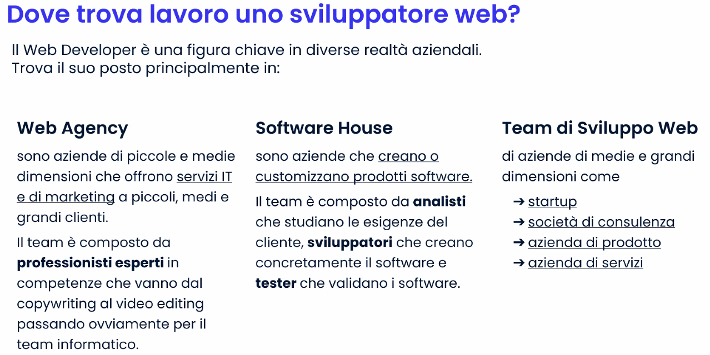

# Simone Rubichi Career Advisor

- Contattare ad ogni mossa nella ricerca del lavoro

Tre macroaree:
- Web agency
- Prodotti e servizi
- Consulenze

Possiamo essere inseriti in qualsiasi settore perchè oggi il mondo digitale comprende tutte le aree. 

## Passione e attitudine è ciò che le aziende cercano

### Il curriculum deve essere personalizzato e funzionale.

fotoroom per le foto profilo
ticonsiglio per il trattamento dei dati (prendi la frase più pulita e corta)

- Posso candidarmi anche dove non ho le giuste competenze tecniche perchè ho sviluppato una mentalita legata al problem solving e capace di implementare nuove capacità.

- Fai emergere dalle esperienze le positività che ti hanno portato.

#### Utilizza CANVA e VISTACREATE

- Utilizza sempre forme morbide, senza spigoli.
- simone@boolean.careers con nome cognome e classe il pdf con nome cognome - cv

## Personalizza i colori del CV in base a quelli dell'azienda a cui ti presenti

## Linkedin

#### Sezioni efficaci :

