https://dev.mysql.com/doc/refman/8.0/en/data-types.html

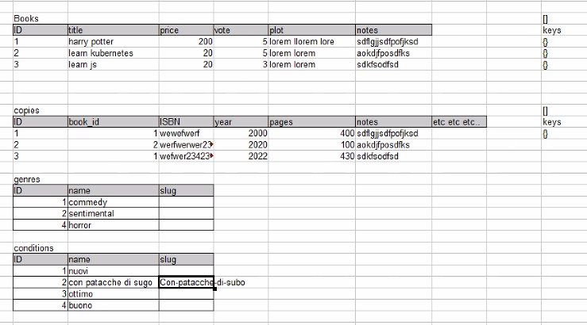

# SQL

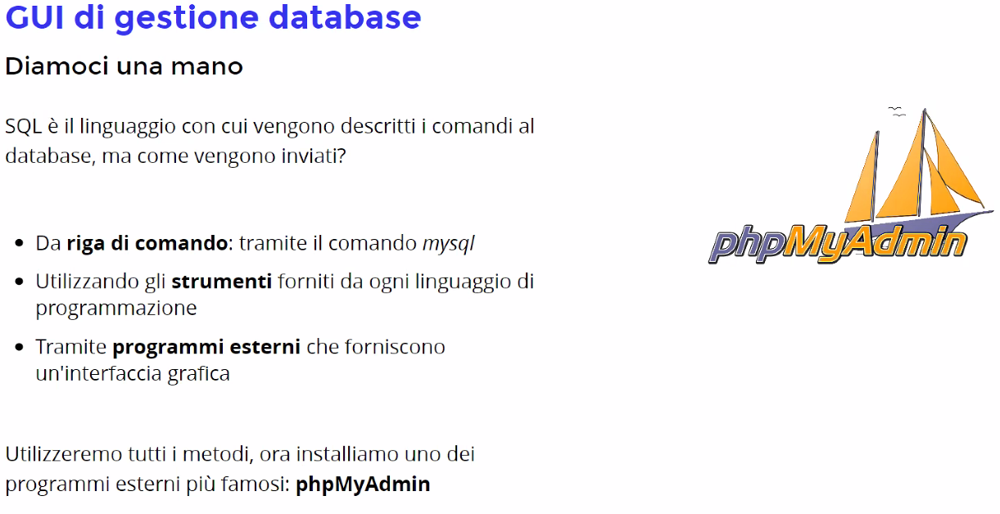

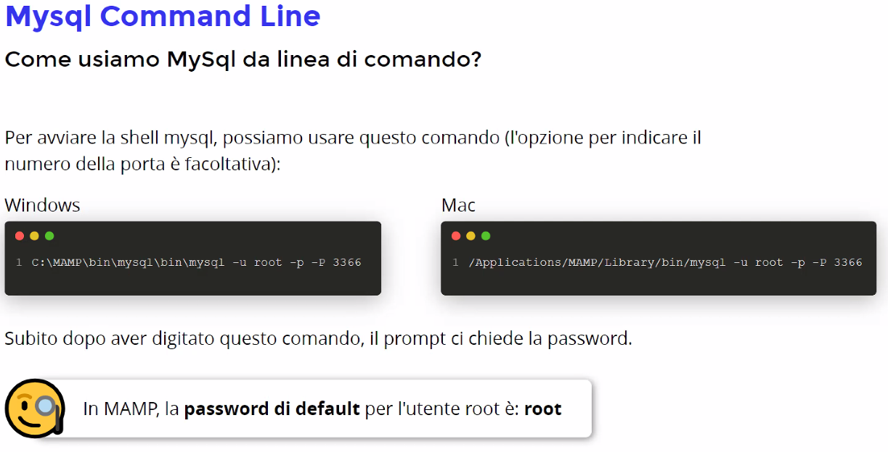

# Per Windows:

## C:\MAMP\bin\mysql\bin\mysql -u root -p -P 3366

## Nb: il -P 3366 é opzionala meno che non hai la porta 3306 o alter settate sul db - se port é 3306 il valore é di default
## /Applications/MAMP/Library/bin/mysql -u root -p -P 3366

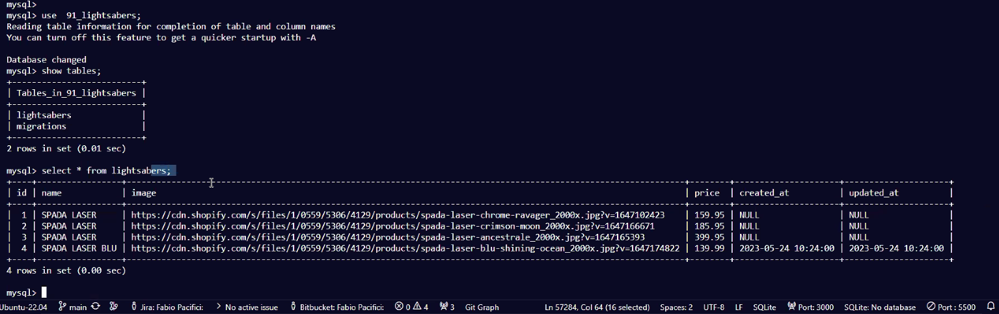

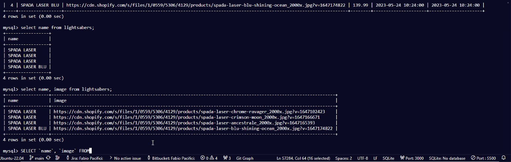

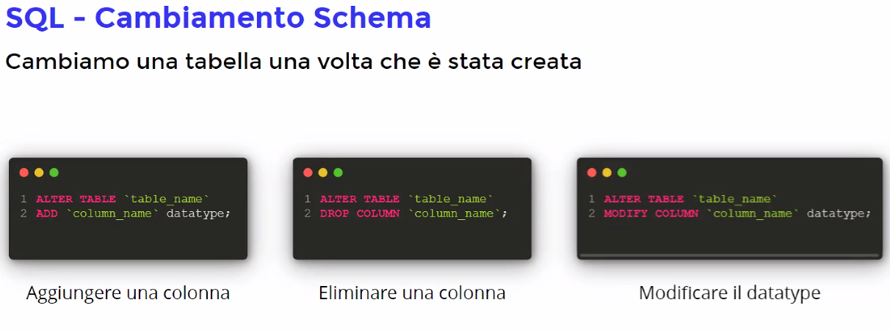

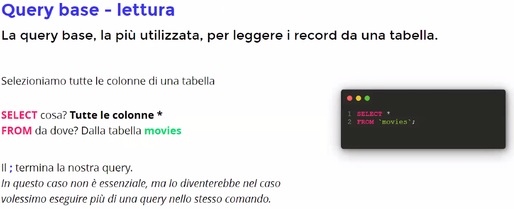

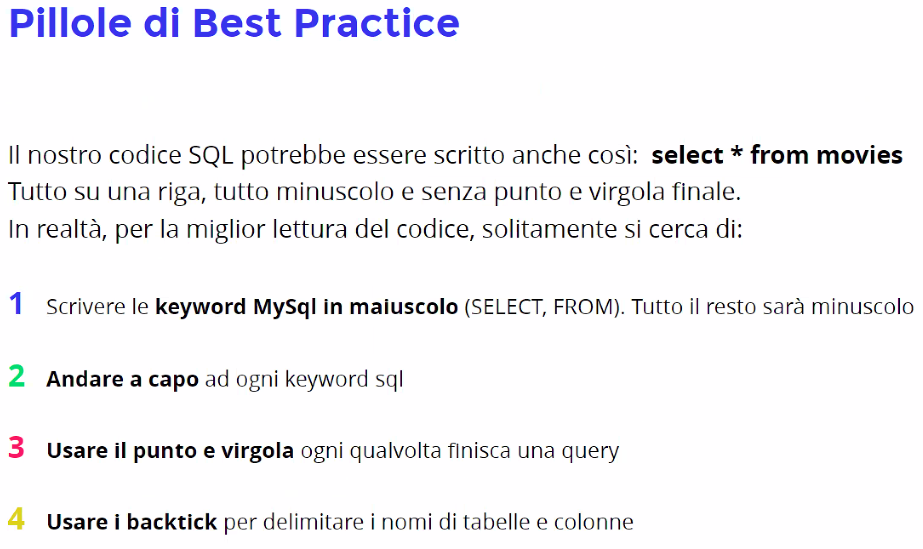

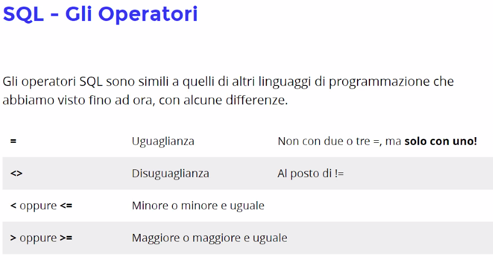

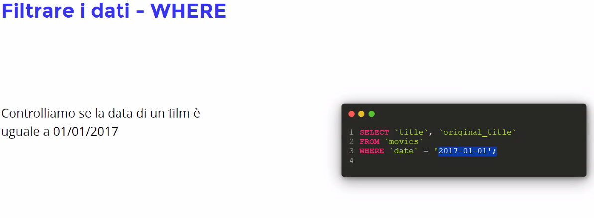

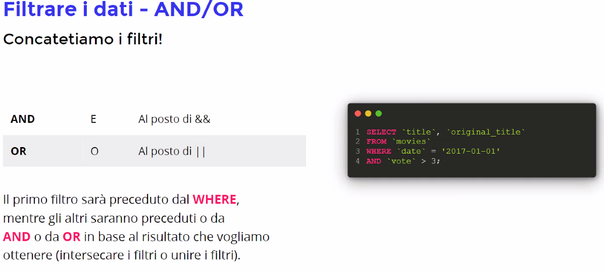

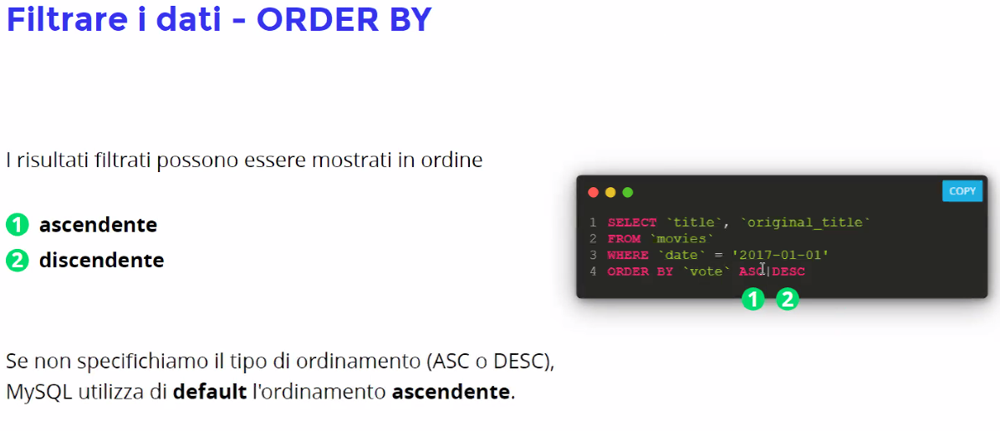

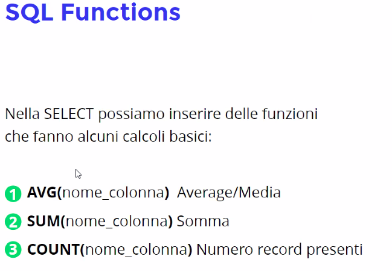

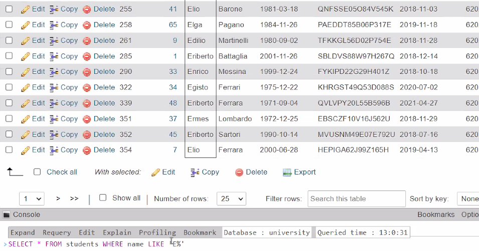

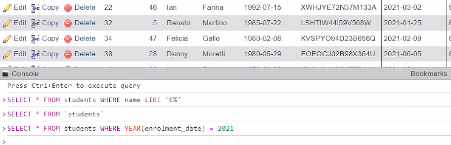

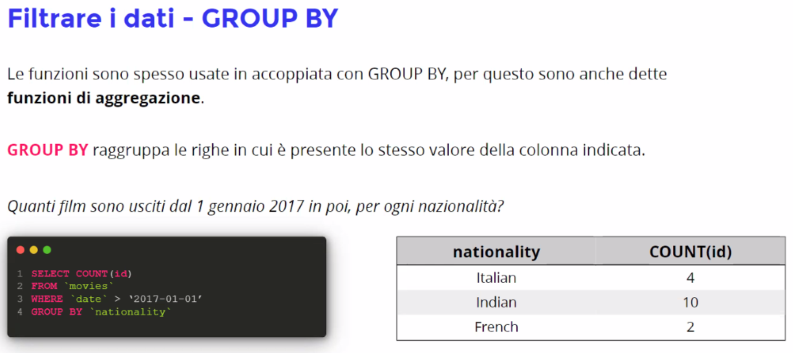

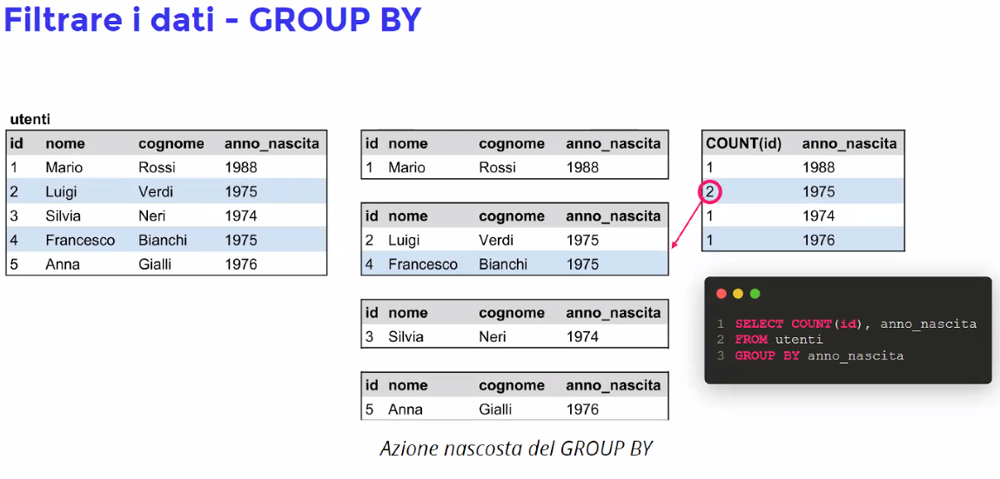

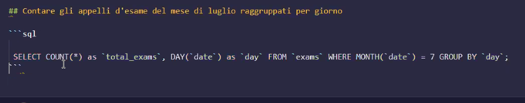

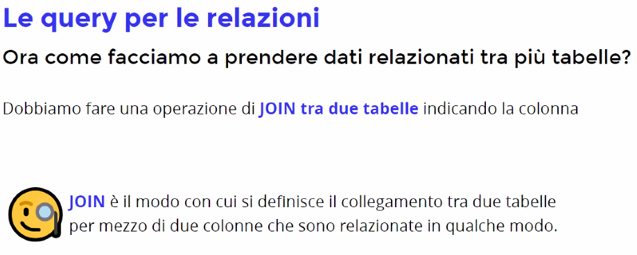

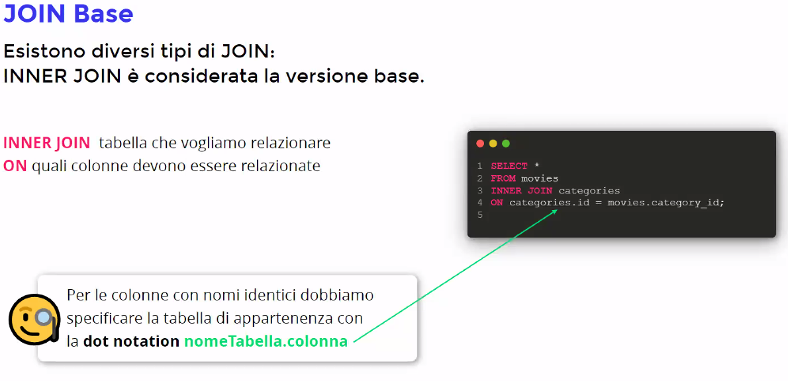

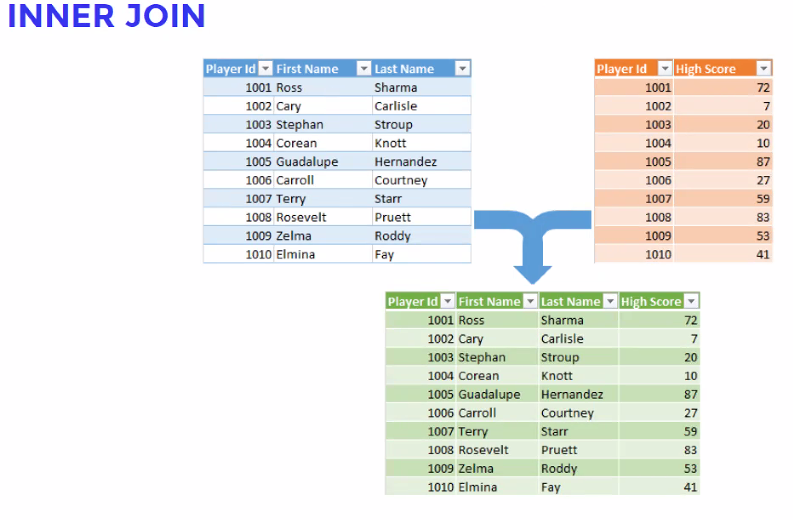

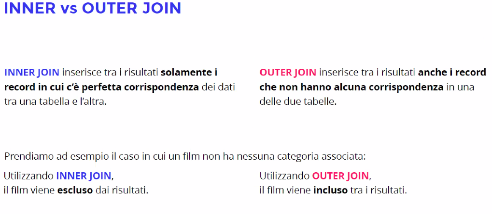

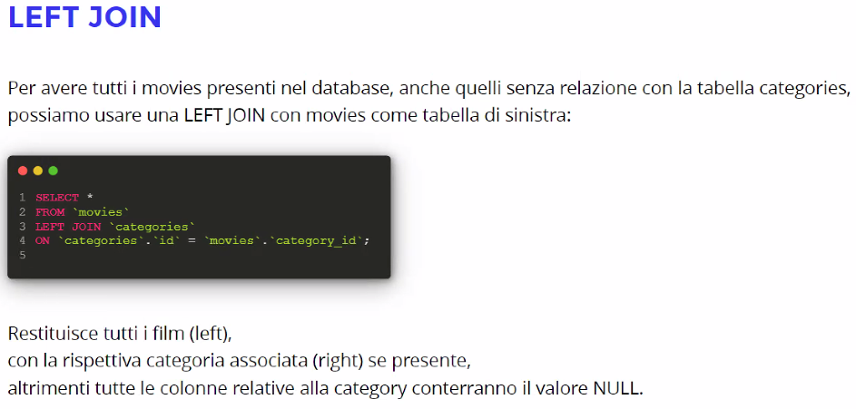

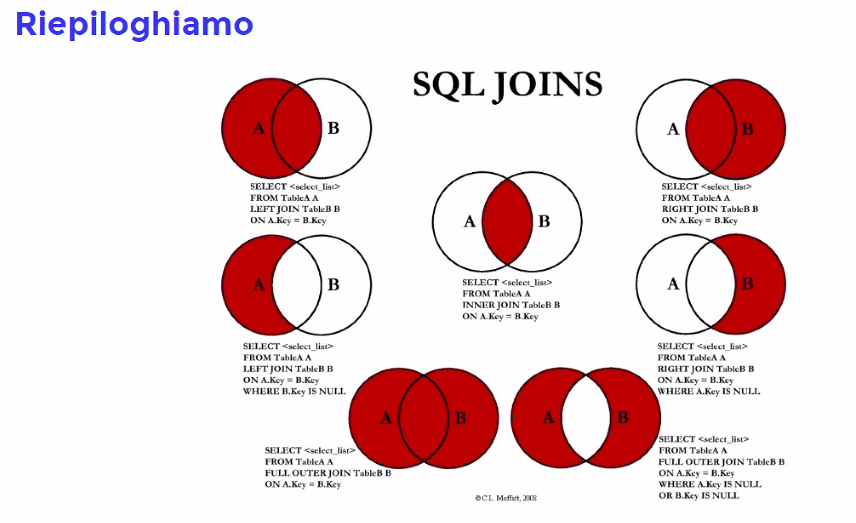

# OOP - Programmazione Orientata all'Oggetto

