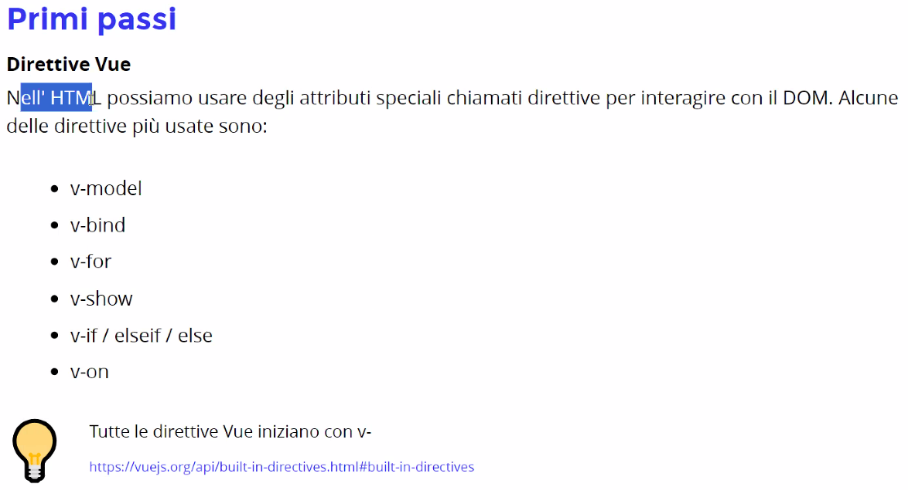
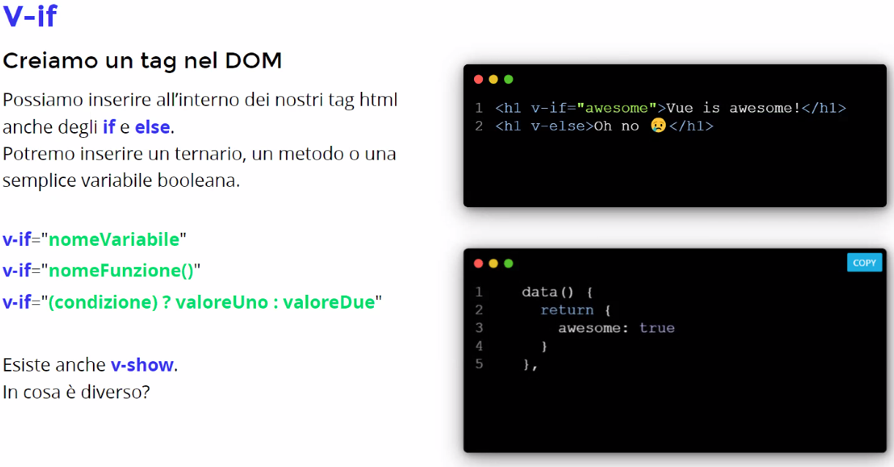
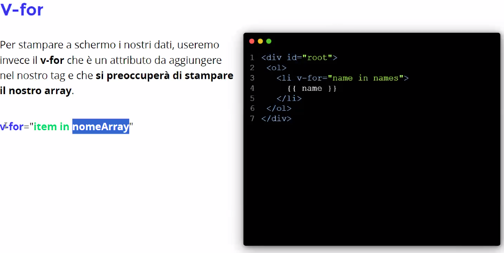
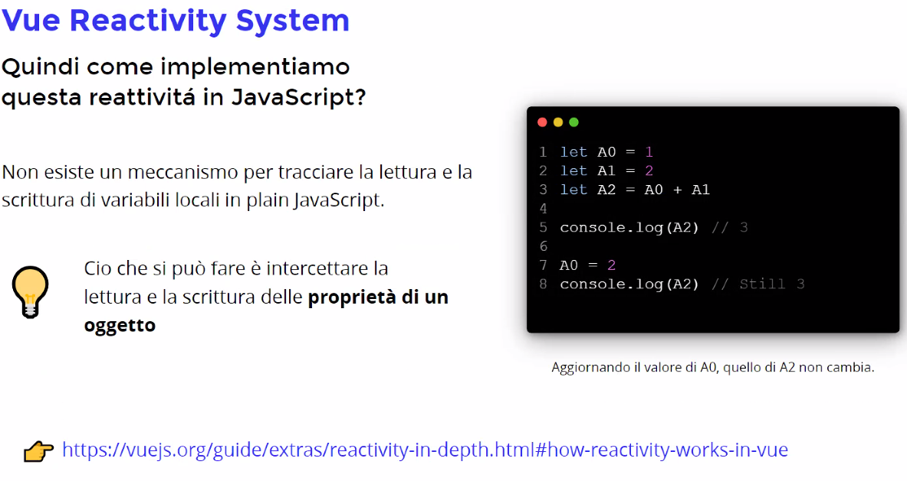
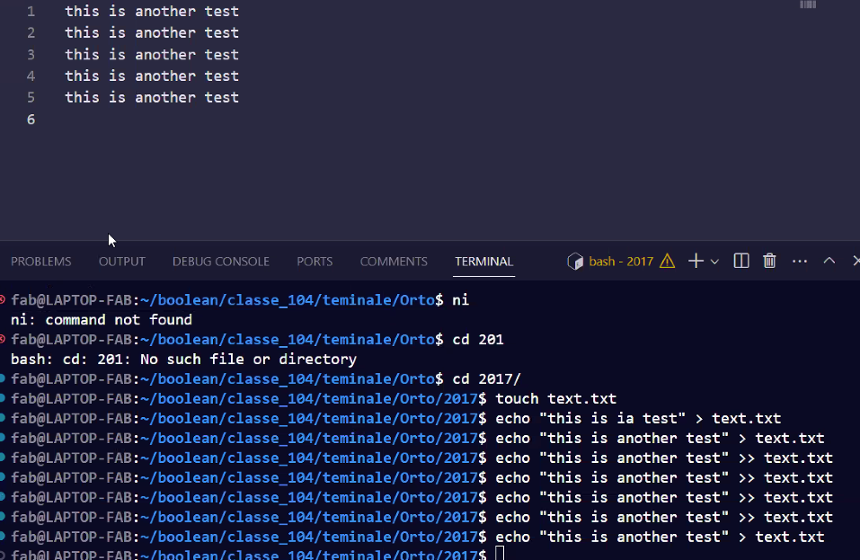
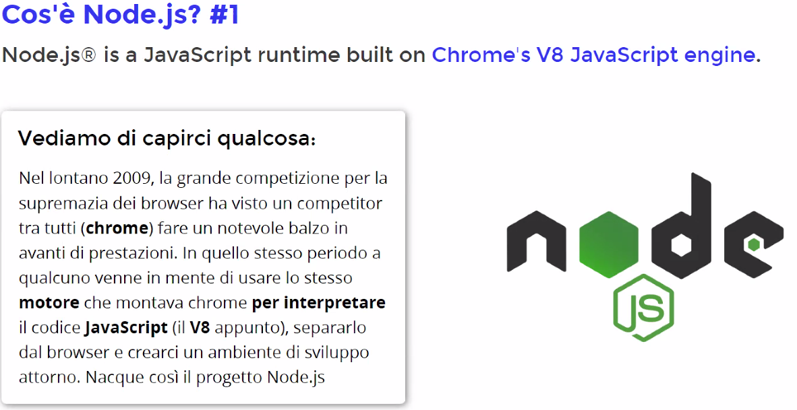
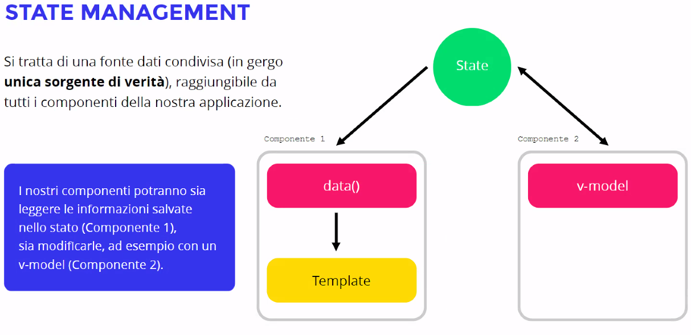

# VUE JS Framework javascript

Tutto il codice è caricato su un'unica pagina in modo da essere più veloce. 

DA LEGGERE: 
- https://vuejs.org/guide/essentials/template-syntax.html
- https://vuejs.org/guide/essentials/class-and-style.html
-https://vuejs.org/guide/essentials/conditional.html
- https://vuejs.org/guide/essentials/list.html
- https://vuejs.org/guide/essentials/event-handling.html
- https://vuejs.org/guide/essentials/forms.html
- https://vuejs.org/guide/essentials/lifecycle.html

# API - come far dialogare la nostra pagina con l'esterno

L'HTTP è il protocollo principale per fare queste chiamate per recuperare i dati.
Su network in ispeziona selezionando all possiamo vedere tutte le richieste della pagina.
## L'http - body è la parte dopo le slash nel nome del sito(URI)

Per evitare attese si usa una chiamata Asincrona, così il sito continua a lavorare e quando è pronto ci consegna la risposta.

## In ordine script di axios, script vue e poi il nostro script.

## La query string è tutto quello scritto dopo il punto di domanda

## power shell

https://programminghistorian.org/en/lessons/intro-to-powershell

## bash

# Node.js è un programma che ci permette di entrare in librerie

Diventa quindi un linguaggio sia front che back-end. Usiamo quindi un unico linguaggio di programmazione.
Ci permette di eseguire un server web locale, sul nostro pc.

# Trovo info per inserire le immagini in Static Asset Handling

# SASS Nuovo modo per il css

# Ascoltiamo gli eventi

# Per usare emit inserisco $emit sul figlio e gli dò il valore. Per richiamarlo sul componente genitore uso la @ con il nome della mia emit e come valore passo la funzione che mi serviva.